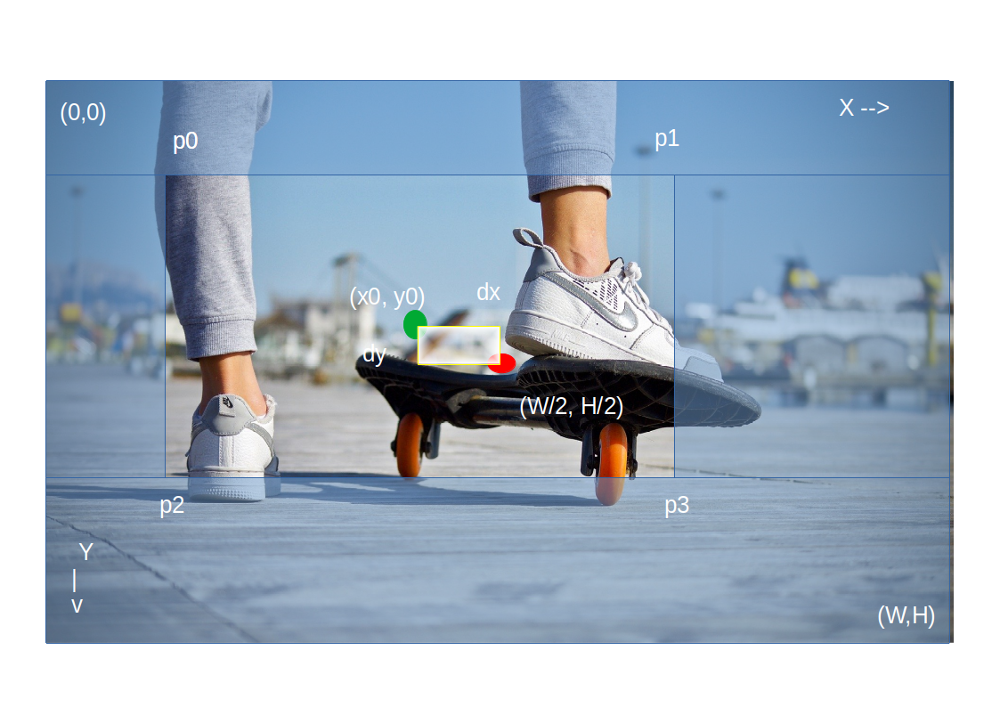

# SimpleVideoEditor

## Acknowledgement
Special thanks to:
1. [MasayukiSuda/Mp4Composer-android](https://github.com/MasayukiSuda/Mp4Composer-android)
2. [cats-oss/android-gpuimage](https://github.com/cats-oss/android-gpuimage)

## :tada: The library is now available via jitpack.io :rocket:
**Warning** Please note that I should change some file names, variables in strings.xml etc. Otherwise they may conflict with user's app resulting
unprecedented problems. Sorry for inconvenience.

To import the library:
Add it in your root build.gradle at the end of repositories:
```
buildscript {
    repositories {
        google()
        jcenter()
    }
    dependencies {
        classpath 'com.android.tools.build:gradle:4.0.1'
        classpath "org.jetbrains.kotlin:kotlin-gradle-plugin:1.3.72"    // <-- ADD THIS LINE
    }
}
allprojects {
		repositories {
			// ...
			maven { url 'https://www.jitpack.io' }  // <-- ADD THIS LINE
		}
	}
```
Next, open your app's `build.gradle` file, and add this at the top:
```
apply plugin: 'com.android.application'
apply plugin: 'kotlin-android'
apply plugin: 'kotlin-android-extensions'
```
And in the android block, add this:
```
android{
    // other configs
    compileOptions {
        sourceCompatibility JavaVersion.VERSION_1_8
        targetCompatibility JavaVersion.VERSION_1_8
    }

    kotlinOptions {
        jvmTarget = "1.8"
    }
        // other configs
}
```
Finally, add the dependency
```
dependencies {
        implementation 'com.github.fahimfarhan:SimpleVideoEditor:v1.0'
}
```
That's it!

## todo:
1. study some photo editors like [burhanrashid52/PhotoEditor](https://github.com/burhanrashid52/PhotoEditor), and implement text, stickers etc support
# Crop Explanation
The crop mechanism was not well documented in the Mp4Composer-android library,
 so I had to go through a lot of trials and errors
to understand what the library was actually doing. I am quite sure this is what the library input means.
For simplicity, assume that our video frame does not change its shape, but our crop area changes shape / moves
when the user drags / moves / does something.



Here as you can see, the video frame has height `H` pixel, width `W` pixel and so its center is `(W/2, H/2)`.

So, AspectRatio, `r = cropQuadWidth : cropQuadHeight = W:H`

Suppose initially the crop quad has exactly the same dimensions as the video frame, that is, it has same 
height, width and center `(W/2, H/2)`. Now the user uses pinch gesture to resize the crop quad by `saving the 
aspect ratio r` and `keeping the center` where it is. 
Now suppose the user uses a drag gesture to move the crop quad so that its `new center` is `(x0,y0)`.

Therefore, the `translation` is 
```
    dx = (x0 - W/2)  pixel,  
    dy = (y0 - H/2)  pixel
```

We can represent the crop quad with its 4 corner points: `p0, p1, p2, p3` as shown in the picture.
Since our aspect ratio is fixed, our crop quad also has aspect ratio `r`.

Our crop quads 
    ```
    newWidth = (p3.x - p0.x)  pixel
    newHeight = newWidth/r = (p3.y - p0.y) pixel
    ```
Now for some reason you need to  divide dx with newWidth, dy with newHeight and multiply them with 2.
Don't ask me why. The library input wants this :/
So 
```
    translationX = dx * 2 / newWidth;
    translationY = dy * 2 / newHeight;
```


Therefore, on pinch gesture, the crop quad has a scaling factor,
                ``` scalingFactor = initialWidthOfCropQuad / finalWidthOfCropQuad
                 => scalingFactor = W / newWidth = W / (p3.x - p0.x)
                                  = H / newHeight = H / (p3.y - p0.y)
                ```
Just use a formula that you like.
If you implement a rotation in your video editor, make sure to save it in a variable `rotation = theta`.
I didnot use this feature, so I don't remember details (degree or radian, clockwise, anticlockwise etc)
at the time of writing.
Since I am not rotating, my rotation is zero. So `rotation = 0`

Now that we have all the input parameters ready, we can create a `FillModeCustomItem` object like this:
```
        FillModeCustomItem fillModeCustomItem = new FillModeCustomItem(
                scalingFactor,
                rotation,
                translateX,
                translateY,
                W ,         // the video Width = W pixel
                H           // the video Height = H pixel
        );
```               
And finally pass this `fillModeCustomItem` into mp4composer to get the desired crop area. You need to specify 
the output videos height and width. 
Let `outputVideoWidthPx = 720 pixel` and `outputVideoHeightPx = outputWidth/r` which is the crop quad's
width and height. It's not entirely clear to my how / why this works. The original developers gave a sample
where the crop area was fixed and the video frame resized itself. So perhaps internally, the library takes a quad 
of  `outputVideoWidthPx`, `outputVideoHeightPx` centered at `(x0, y0)`, then zooms the video 
frame (using that `scalingFactor`) and translates `translationX`, `translationY` amount to track the actual crop area.

Finally, you do this in java:
```
        mp4Composer = new Mp4Composer(selectedVideoUri, destPath, activity, mylogger);
        mp4Composer
                .size(outputVideoWidthPx, outputVideoHeightPx) // fake it till you make it
                .fillMode(FillMode.CUSTOM)
                .customFillMode(fillModeCustomItem);
        // todo: other inputs according to your requirements
        mp4Composer.start();                
```
# Example:
<!-- [I'm trying to crop a square portion of 300X300 pixel in a 720x1280 video with offset in Y.](https://github.com/MasayukiSuda/Mp4Composer-android/issues/36#issuecomment-452312234)
720x1280 input video so width = 720 pixel, height = 1280 pixel (I'm not sure about this notation, might be wrong. In that case toogle the values)
```
        FillModeCustomItem fillModeCustomItem = new FillModeCustomItem(
                scalingFactor,
                rotation,
                0,     // probably translateX = 0 because the question says he only translates on Y axis
                translateY,
                720 ,         // the video Width = W pixel
                1280           // the video Height = H pixel
        );

        // ... some codes

        mp4Composer = new Mp4Composer(selectedVideoUri, destPath, activity, mylogger);
        mp4Composer
                .size(300 , 300) // fake it till you make it
                .fillMode(FillMode.CUSTOM)
                .customFillMode(fillModeCustomItem);
        // todo: other inputs according to your requirements
        mp4Composer.start();                
``` -->

Please check out [VideoEditorPresenter.java#L83](https://github.com/fahimfarhan/SimpleVideoEditor/blob/61ef2c4f580518dfc349a46ba96240fba54e0be9/app/src/main/java/com/fahimfarhan/simplevideoeditor/videoeditor/VideoEditorPresenter.java#L83), it shows my implementation.

You can also download my project, run it and try to have a better understanding. 
If you have any questions, feel free to ask me and I'll
try my utmost to answer them. Thank you. 
